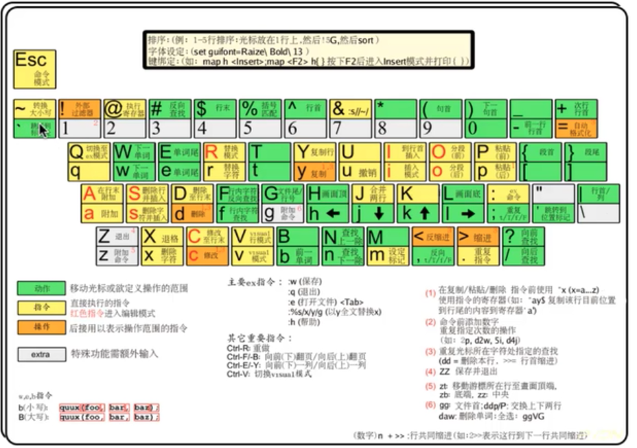

# vim学习笔记
|命令|对应的光标动作|
|:---:|------|
|w|正向移动到下一个单词首字母|
|b|反向移动到首字母|
|e|正向尾字母|
|ge|反向尾字母|
|||
|f{char}|正向移动找{char}|
|F{char}|反向移动找{char}|
|t{char}|正向{char}的前一个字符|
|T{char}|反向{char}的后一个字符|
|;|重复上次查找|
|,|反转方向查找|
|||
|d{motion}|删除模式 dd删除一行|
|c{motion}|修改模式 cc修改一行|
|y{motion}|复制模式 yy复制一行|
|v{motion}|可视模式|
|||
|m{mark}|设置标记|
|`{mark}|返回标记|
|y|复制|
|p|粘贴|
|||
|control+f|下翻一页|
|control+b|上翻一页|
|control+d|下翻半页|
|control+u|上翻半页|
|||
|/{pattern}|查找，n跳转|
|:%s/{pattern}/{string}/g|替换，c确认|
  
   

|文本对象|选择区域|
|---|----|
|a) or ab|around圆 括号|
|i) or ib|inside 圆括号|
|a} or aB|around 花括号|
|i} or iB|inside花括号|
|a]|around[]|
|i]|inside[]|
|a>|around <>|
|i>|inside<>|
|a'|around ''|
|i'|inside''|
|a"|around""|
|i"|inside""|
|a`|around``|
|i`|inside``|
|at|xml标签：例如<xml>tags<xml>等|
|it|xml标签内部tags|
|||
|iw|当前单词|
|aw|当前单词及一个空格|
|iW|当前字串|
|aW|当前字串及一个空格|
|is|当前句子|
|as|当前句子及一个空格|
|ip|当前段落|
|ap|当前段落及一个空行|
  
  

